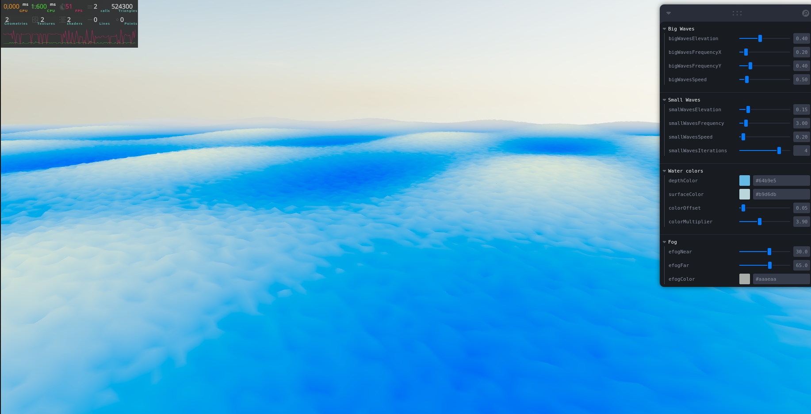
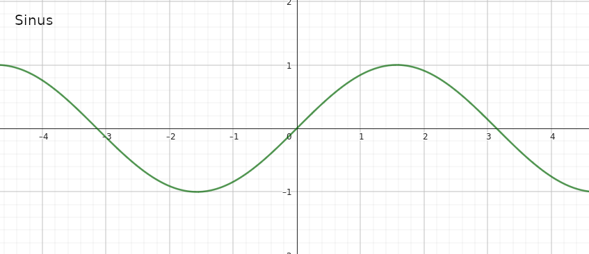
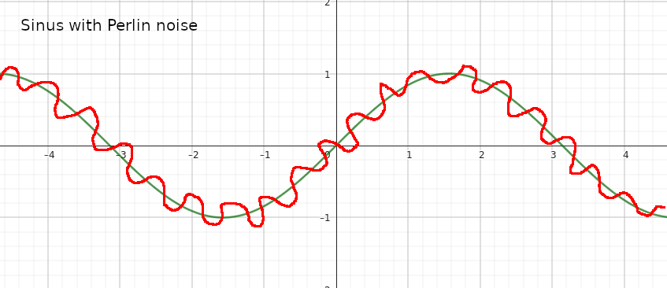

# waterShaderEditor4WebGL

Live : https://maxxiiime.github.io/waterShaderEditor4WebGL/

Before reading the next part, feel free to play with each parameter and understand their effects.

## Parameters

### Big waves

**Elevation :** Select max height of big wave

**Frequency X/Y :** Play with frequency of waves on the x/y axis

**Speed :** Choose wave speed

## Small waves

For a more realistic effect, I choose to make "small waves", to make it short I added a "noise" on the sinus.

Ex.

**Elevation :** Max height of small wave

**Frequency :** Frequence of small wave

**Speed :** Speed of small wave

**Iteration :** Iteration number of Perlin noise on the sinus (⚠️Be careful, this parameter can affect your browser performances)

## Water color

**Depth color :** Color of the deepest waters

**Surfece color :** Color of water on the surface

**Color offset :** Offset the water elevation value, use this parameter to increase the water surface color zone

**Color multiplier :** Increase "distance" between surface and depth value

## Fog

**fog near :** Change the start/nearest position of fog

**fog far :** Change the end/farthest position of fog

**fog color :** Chanhe the fog color
